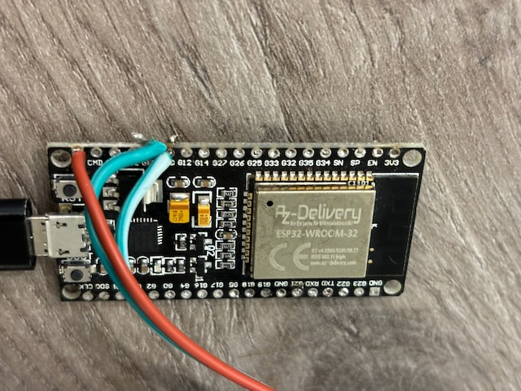
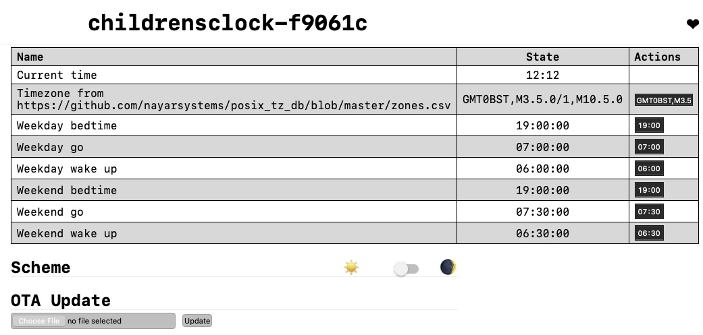
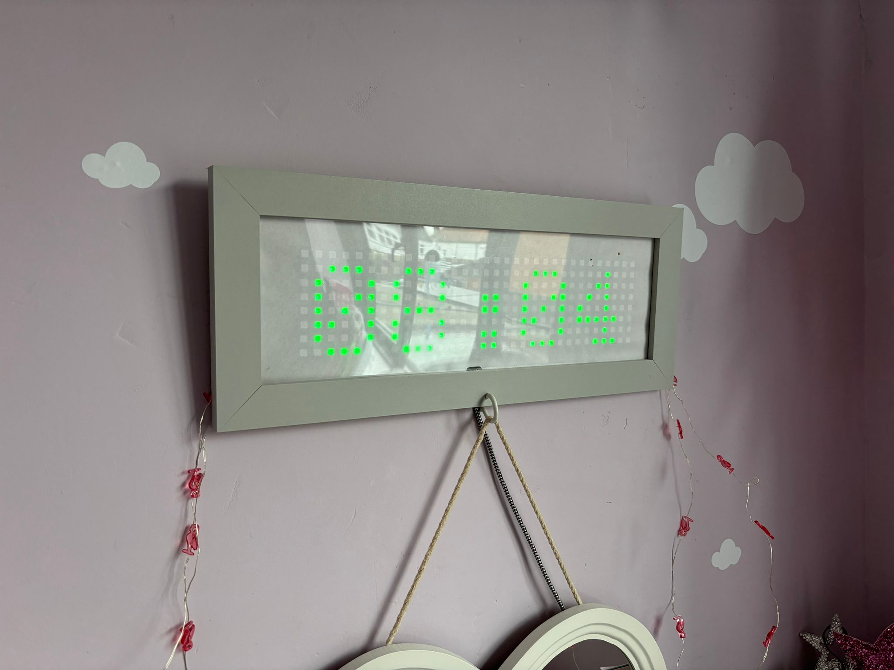
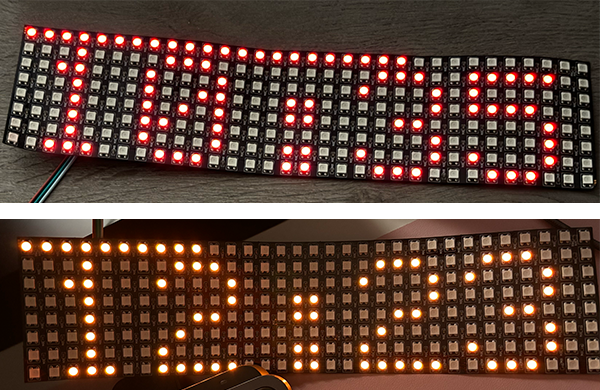
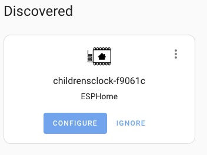
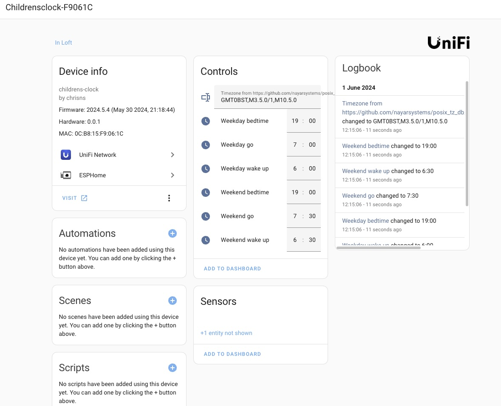

# Children's IoT Clock

[](https://github.com/chrisns/childrens-clock/actions/workflows/ci.yaml)
[](https://github.com/chrisns/childrens-clock/actions/workflows/security.yml)


## Why

This was a thing I made my kids after buying and becoming 🤯 frustrated with many different [commercial offerings](https://www.google.com/search?q=childrens+coloured+clock+wake+up&udm=3)/[[duckduckgo]](https://duckduckgo.com/?q=childrens+clock+wake+up&iar=shopping) that:

- Lost track of time if unplugged
- Manually updating time was hard and fiddly
- Didn't update the time for daylight savings
- Updating the config or time required it being in 'awake' mode, lighting up a dark room
- Couldn't be easily adjusted for weekends or ad-hoc for holidays/late nights
- If the Child could read, and/or count the stars, they would often need get out of bed to get near enough to the clock to determine more than just the color of the light; potentially putting on glasses if needed.
- Didn't provide a "its ok to be awake, and play/read quietly, but stay in your room"
- It would age quickly and not look grown up
- It wouldn't collect data - future plans to put temp sensors, bluetooth relay, and sensors (**not a camera**!)
- Couldn't be made to do all sorts of other things I could think up with a [tiny computer](https://en.wikipedia.org/wiki/ESP32) that is around 15,000 times more powerful than [what is required to land on the moon!](https://en.wikipedia.org/wiki/Apollo_Guidance_Computer)

## When (History)

So I made a thing! 😱😱😱  _confession: 🤫 this isn't the first generation, previous code is [open](https://github.com/chrisns/my-esphome-devices/blob/d97260ce4b8e330513456011d3693e02f36b1b73/noahclock.yaml) though without documentation_

## What

[](https://esphome.io/guides/made_for_esphome)

This is made for [Made for ESPHome](https://esphome.io/) so you should be able to go buy a cheap led matrix, esp32, solder 3 pins, flash the chip and you've got something that even works with [Home Assistant](https://www.home-assistant.io/)!

## How to

You will need to buy:

- 1x [ESP32](https://www.aliexpress.com/item/1005006692499859.html) £1.91 _(worth buying a few in case you mess up the soldering)_
- 1x [WS2812B 8x32 LED Matrix](https://www.aliexpress.com/item/1005002399031444.html) £2.59
- 1x [15x5" Photo frame](https://www.amazon.co.uk/dp/B0BBPJPFC9)

You will need:

- A soldering iron
- Some solder
- A usb cable

### Build

#### Solder

  1. `RED` 5v wire on the matrix > the `5v` pin on the esp32
  1. `WHITE` gnd wire on the matrix > a `gnd` pin on the esp32
  1. `GREEN` din wire on the matrix > `13` pin on the esp32

You should end up with something (more tidy than this pic)



#### Flash

You'll now need to flash the board

1. Connect the ESP32 board to your computer
1. Download the [latest firmware image](https://github.com/chrisns/childrens-clock/releases/latest/download/firmware-factory.bin)
1. Go to [web.esphome.io](https://web.esphome.io/)
1. Click connect, and select the serial port for your device
1. Click install
1. Follow the buttons to connect to the wifi, and away you go!

#### Configure

> When configuring the timezone, you'll need to refer to the [`POSIX` timezone config](https://github.com/nayarsystems/posix_tz_db/blob/master/zones.csv) just copy paste from this page into the config page of the device and you're good.



| Config          | Color                                   | Description                                                                    |
| --------------- | --------------------------------------- | ------------------------------------------------------------------------------ |
| Weekend wake up | <span style="color:orange">Amber</span> | The time its ok for your kid to get up and quietly read on a weekend (sat+sun) |
| Weekend bedtime | <span style="color:red">Red</span>      | The time your kid should go to bed on a weekend (sat+sun)                      |
| Weekend go      | <span style="color:green">Green</span>  | The time its ok for your kid to come jump on your bed on a weekend (sat+sun)   |
| Weekday wake up | <span style="color:orange">Amber</span> | The time its ok for your kid to get up and quietly read on a weekday (mon-fri) |
| Weekday bedtime | <span style="color:red">Red</span>      | The time your kid should go to bed on a weekday (mon-fri)                      |
| Weekday go      | <span style="color:green">Green</span>  | The time its ok for your kid to come jump on your bed on a weekday (mon-fri)   |

#### Mount

I've put mine in a photo frame with just a sheet of white paper in front of the matrix to diffuse it a bit, you might like to try something more bespoke for your kids, maybe some art, picture of a pet/family etc.

#### Install

It's a photo frame, so putting it on the wall should be easy



#### Explain

Theres some dots on the top of the matrix, these reduce over time until its the next phase, so provide a visual countdown, if your kid wakes up in the night _"how many dots are left?"_ is a simple way for them to figure out how long is left, and for you to ask why they're jumping on you in the dark without opening your eyes and send them back to bed, because they should know better.



#### Forget it

After configuration, it should just continue to work, it'll continue to get its time from the internet, automatically adjust for daylight savings (if that applies to you).

#### Extend

The code is open source! so feel free to extend this, do fun things, add temp sensors, air quality, buzzers, speakers, motors, the possibilities are endless, **PLEASE SHARE** what you do, take photos, share the code, make a pull request, or just raise an 'issue' with your pics and I'll point at them.

This should already work with [Home Assistant](https://www.home-assistant.io/), if you've got Home Assistant installed it should find the device on your network and offer to connect to it, if not you can give it the address of the device.




THANKS!

#### Other

If you flash the device and it fails to connect to your wifi for whatever reason, it'll run its own access point that you can connect to. It also provides a bluetooth provisioner that you can use. Just go to <https://www.improv-wifi.com/>

---

## Development

This is all intended to use [dev containers](https://containers.dev/)

### Run tests

```bash
rake test
```

```raw
Test 'TestMain.c'
-----------------
Running TestMain.out...

--------------------
OVERALL TEST SUMMARY
--------------------
TESTED:  5
PASSED:  5
FAILED:  0
IGNORED: 0
```

### Run tests on code change

```bash
guard
```

### Build

```bash
rake build
```
